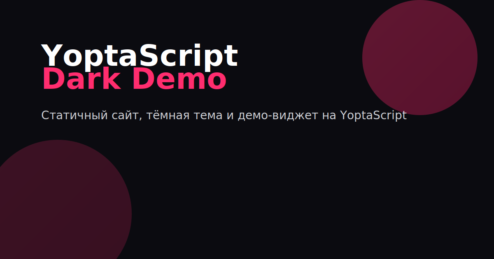

# YoptaScript Dark Demo

Статичный сайт с интерактивным демо‑виджетом на YoptaScript. Тёмная тема с розовыми акцентами, адаптив и высокая производительность.

## Подключение YoptaScript

- Официальный репозиторий: https://github.com/samgozman/YoptaScript
- Рантайм: `dist/yopta.js` (локальная копия в `js/yopta.js`)
- Альтернатива CDN: `https://cdn.jsdelivr.net/gh/samgozman/YoptaScript/dist/yopta.js`

Пример использования (эталон в README репозитория):

```html
<!-- Код на YoptaScript (можно inline или из файла через src) -->
<script language="YoptaScript" src="yopta/main.yopta"></script>

<!-- Рантайм внизу body -->
<script src="js/yopta.js"></script>
```

## Структура

```
/
  index.html
  /assets
    /css/styles.css
    /img/...
  /js
    yopta.js          # рантайм из dist
  /yopta
    main.yopta        # исходник YoptaScript (демо‑виджет)
  README.md
  package.json
  robots.txt
  sitemap.xml
  manifest.json
```

## Локальный запуск

```
npm i
npm run start
# откройте http://127.0.0.1:5173
```

## Деплой в GitHub Pages

Вариант 1 (через пакет `gh-pages`):

1. Проставьте `homepage` в `package.json` на `https://kaldyrr.github.io/yop`
2. Выполните:

```
npm run deploy
```

Вариант 2 (рекомендуется): GitHub Actions — workflow `.github/workflows/pages.yml` уже добавлен. На `push` в `main` соберёт и развернёт статический артефакт на Pages.

## Lighthouse

Макет рассчитан на ≥95 по Performance/Accessibility/Best Practices/SEO на десктопе: небольшой бандл, семантика, метаданные, доступность, плавные анимации без дёрганий.

## Скриншот



